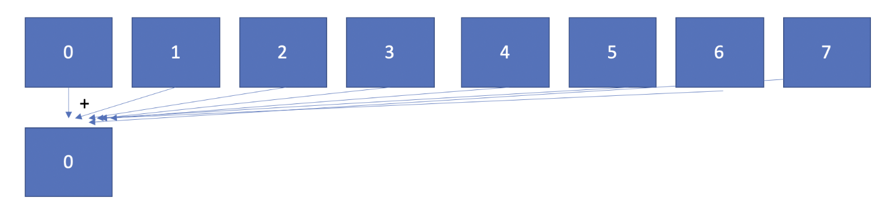
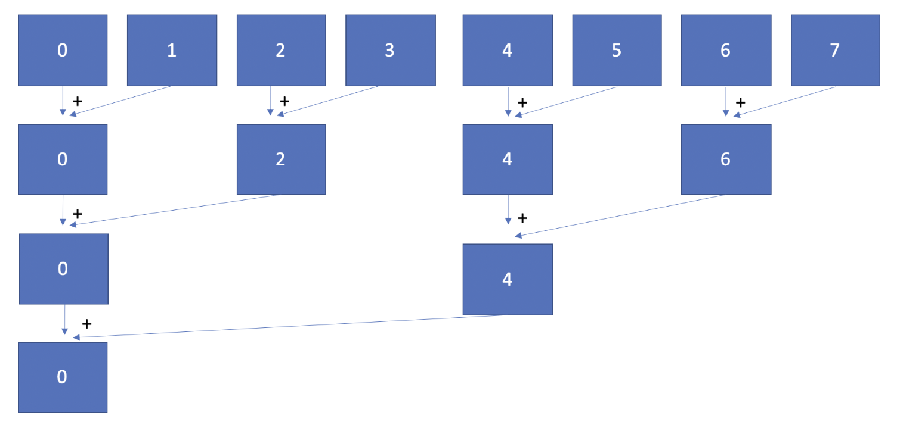
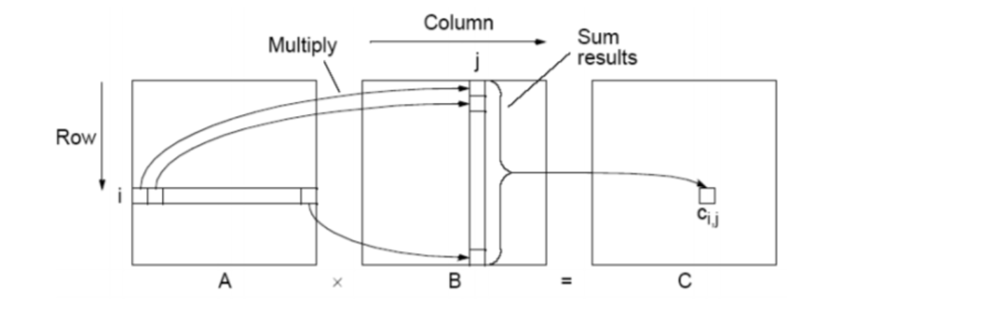

## MPI Programming

### Part 1: Getting Familiar with MPI Programming
#### 1.1 MPI Hello World, Getting Familiar with the MPI Environment
Here we’re going to implement our first MPI program.

Expected knowledge includes basic understanding of the MPI environment, how to compile an MPI program, how to set the number of MPI processes, and retrieve the rank of the process and number of MPI processes at runtime.

Let’s learn how to launch an MPI code on NYCU-PP workstations.

There is a starter code for you. Look at `hello.cc`. Please finish the _TODO_s with the `MPI_Comm_size` and `MPI_Comm_rank` functions.

We will work on NFS (which is already set up ), so we don’t need to copy and compile the code again and again on different nodes.

Let’s first compile `hello.cc` on NFS:

```bash
$ cd ./HW4
$ mpicxx ./hello.cc -o mpi_hello
```

Then create a file `hosts`, which is a text file with hosts specified, one per line. We will use the file to specify on which hosts to launch MPI processes when running `mpirun`. For example, we put the following two lines into the file to specify we will launch MPI processes on nodes `pp2` and `pp3`. Notice that you should use the same hostnames as in `~/.ssh/config`.

##### hosts:
```bash
pp2 # 1st node hostname
pp3 # 2ed node hostname
```

Make sure `mpi_hello` is located in the same directory hierarchy on the two nodes (should not be a problem under NFS) before running `mpirun` to start MPI processes:

```bash
$ mpirun -np 8 --hostfile hosts mpi_hello
```

This command will launch eight processes to run `mpi_hello` on the two nodes, and you should be able to get an output similar to:
```
Hello world from processor ec037-072, rank 0 out of 8 processors
Hello world from processor ec037-072, rank 1 out of 8 processors
Hello world from processor ec037-072, rank 3 out of 8 processors
Hello world from processor ec037-072, rank 2 out of 8 processors
Hello world from processor ec037-073, rank 4 out of 8 processors
Hello world from processor ec037-073, rank 6 out of 8 processors
Hello world from processor ec037-073, rank 5 out of 8 processors
Hello world from processor ec037-073, rank 7 out of 8 processors
```

> There may be some `No protocol specified` messages in the beginning, it’s ok to just ignore them.

#### 1.2 Calculating PI with MPI
In this exercise, we are going to parallelize the calculation of Pi following a Monte Carlo method and using different communication functions and measure their performance.

Expected knowledge is MPI blocking and non-blocking communication, collective operations, and one-sided communication.

Instructions: Write different versions of MPI codes to calculate Pi. The technique we are implementing relies on random sampling to obtain numerical results. You have already implemented this in the previous assignments.

##### 1.2.1 MPI BLOCKING COMMUNICATION & LINEAR REDUCTION ALGORITHM
In our parallel implementation, we split the number of iterations of the main loop into all the processes (i.e., `NUM_ITER / num_ranks`). Each process will calculate an intermediate `count`, which is going to be used afterward to calculate the final value of Pi.

To calculate `Pi`, you need to send all the intermediate counts of each process to rank 0. This communication algorithm for reduction operation is called linear as the communication costs scales as the number of processes.

An example of linear reduction with eight processes is as follows:



Rank 0 is going to receive the intermediate `count` calculated by each process and accumulate them to its own count value. (Rank 0 also needs to calculate a `count`, and this stands for the following sections in Part One.) Finally, after rank 0 has received and accumulated all the intermediate counts, it will calculate Pi and show the result, as in the original code.

Implement this code using blocking communication and test its performance.

Hint 1. Change the main loop to include the number of iterations per process, and not `NUM_ITER` (which is the total number of iterations).

Hint 2. Do not forget to multiply the seed of `srand()` with the rank of each process (e.g., `“rank * SEED”`) to ensure the RNGs of processes generate different random numbers.

##### 1.2.2 MPI BLOCKING COMMUNICATION & BINARY TREE REDUCTION COMMUNICATION ALGORITHM
Implement the binary tree communication algorithm for performing the reduction on rank 0 using blocking communication (e.g., `MPI_Send/MPI_Recv`).

The communication pattern for a reduction with a binary tree with eight processes is as follows:



In you implementation, you can assume that we use a power-of-two number of processes.


##### 1.2.3 MPI NON-BLOCKING COMMUNICATION & LINEAR REDUCTION ALGORITHM
Use non-blocking communication for the linear reduction operation (in Section 1.2.1).

Hint: Use a non-blocking `MPI_Irecv()` (MPI Receive with Immediate return). The basic idea is that rank 0 is going to issue all the receive operations and then wait for them to finish. You can either use `MPI_Wait()` individually to wait for each request to finish or `MPI_Waitall()`. Regardless of your decision, keep in mind that we want you to perform the receive operations in parallel. Thus, do not call `MPI_Irecv()` and immediately `MPI_Wait()`! In addition, we recommend you allocate an array of MPI_Request and also an array of counts (i.e., one for each receive needed).


##### 1.2.4 MPI COLLECTIVE: MPI_GATHER
Use the collective `MPI_Gather()` operation, instead of point-to-point communication.

Hint: You can keep rank 0 as the root of the communication and still make this process aggregate manually the intermediate counts. Remember that the goal of `MPI_Gather()` is to provide the root with an array of all the intermediate values. Reuse the array of counts as the output for the gather operation.

##### 1.2.5 MPI COLLECTIVE: MPI_REDUCE
Use the collective `MPI_Reduce()` operation.

Hint 1: Remember that the goal of `MPI_Reduce()` is to perform a collective computation. Use the `MPI_SUM` operator to aggregate all the intermediate count values into rank 0, But, watch out: rank 0 has to provide its own count as well, alongside the one from the other processes.

Hint 2: The send buffer of `MPI_Reduce()` must not match the receive buffer. In other words, use a different variable on rank 0 to store the result.

##### 1.2.6 MPI WINDOWS AND ONE-SIDED COMMUNICATION & LINEAR REDUCTION ALGORITHM

Use MPI Windows and MPI one-sided communication, which we didn’t cover this in class. You can choose the functions you’d like to use but remember that there is a reduction on the same MPI window from many processes! You may refer to `one_side_example.c` to get familiar with it.

### Part 2: Matrix Multiplication with MPI
Write a MPI program which reads an 𝑛×𝑚 matrix 𝐴 and an 𝑚×𝑙 matrix 𝐵, and prints their product, which is stored in an 𝑛×𝑙 matrix 𝐶. An element of matrix 𝐶 is obtained by the following formula:


where 𝑎𝑖𝑗, 𝑏𝑖𝑗 and 𝑐𝑖𝑗 are elements of 𝐴, 𝐵, and 𝐶, respectively.



Your mission is to calculate the matrix multiplication as fast as possible. You may try many methods (Ex: tiling or some algorithms. Note that SIMD isn’t allowed here!) to achieve a higher performance. You are allowed to use any code on the Internet, but you need to re-write the code yourself, which means copying and pasting is not allowed. In addition, you are not allowed to use any third-party library; that is, you have to write your MPI program from scratch. Furthermore, each node is allowed to run a single-threaded process, so using OpenMP, Pthread, fork, GPU, etc. are not allowed.

#### Input
In the first line, three integers 𝑛, 𝑚 and 𝑙 are given separated by space characters. In the following lines, the 𝑛×𝑚 matrix 𝐴 and the 𝑚×𝑙 matrix 𝐵 are given. All the numbers are integers.

#### Output
Print elements of the 𝑛×𝑙 matrix 𝐶(𝑐𝑖𝑗). Print a single space character after “each” element!


#### Constraints
1. 1≤𝑛,𝑚,𝑙≤10000
2. 0≤𝑎𝑖𝑗,𝑏𝑖𝑗≤100

#### Sample Input
```
3 2 3
1 2
0 3
4 5
1 2 1
0 3 2
```

#### Sample Output
```
1 8 5 
0 9 6 
4 23 14 
```
> Note: There is “ \n” at the end of each line!

### References
- [Open MPI 4.0 Document](https://www.open-mpi.org/doc/v4.0/)
- [MPI Tutorial](https://mpitutorial.com/tutorials/)
- [William Gropp, One-sided Communication in MPI](https://wgropp.cs.illinois.edu/courses/cs598-s16/lectures/lecture34.pdf)
