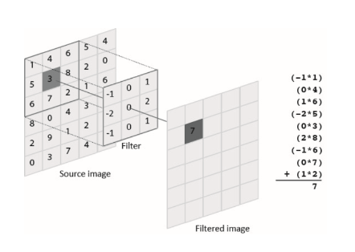
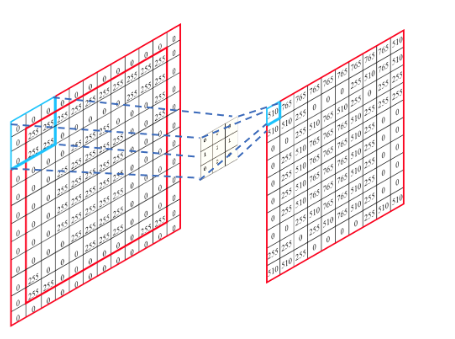

## OpenCL Programming

### Image convolution using OpenCL
Convolution is a common operation in image processing. It is used for blurring, sharpening, embossing, edge detection, and more. The image convolution process is accomplished by doing a convolution between a small matrix (which is called a filter kernel in image processing) and an image.

Figure 1 shows an illustration of the concept of applying a convolution filter to a specific pixel, value of which is `3`. After the convolution process, the value of the pixel becomes `7` —how the resulting value is computed is illustrated on the right of the figure.

  
Figure 1. Applying a convolution filter to the dark gray pixel of the source image (value of which is `3`).

### Problem Statement
In this assignment, you will need to implement a GPU kernel function for convolution in OpenCL by using the zero-padding method. A serial implementation of convolution can be found in `serialConv()` in `serialConv.c`. You can refer to the implementation to port it to OpenCL. You may refer to [this article](https://www.geeksforgeeks.org/cnn-introduction-to-padding/) to learn about the zero-padding method.

Figure 2 shows an example of applying the zero-padding method to the source image (on the left) and thereby resulting a same-size, filtered output image (on the right).

  
Figure 2. Applying the zero-padding method to a source image.

Your job is to parallelize the computation of the convolution using OpenCL. A starter code that spawns OpenCL threads is provided in function `hostFE()`, which is located in `hostFE.c`. hostFE() is the host front-end function that allocates memories and launches a GPU kernel, called `convolution()`, which is located in `kernel.cl`.

Currently `hostFE()` and `convolution()` do not do any computation and return immediately. You should complete these two functions to accomplish this assignment.

### Build & Run
You can build the program by typing `make`, and run the program via `./conv`. Your program should read an input image from `input.bmp`, perform image convolution, and output the result image into `output.bmp`.

### Test
You can use the following command to test your own image:
```bash
ffmpeg -i source.png -pix_fmt gray -vf scale=600:400 destination.bmp
```

You can use a different filter kernel by adding option `-f N `when running the program (i.e., `./conv -f N`), where N is either 1 (by default), 2, or 3, and indicates which filter kernel is used. Each filter kernel is defined in a CSV file (`filter1.csv, filter2.csv, or filter3.csv`). The first line of the CSV file defines the width (or height) of the filter kernel, and the remaining lines define the values of the filter kernel.

### Reference
- [NVIDIA OpenCL SDK Code Samples](https://developer.nvidia.com/opencl)
- [Getting started with OpenCL and GPU Computing](https://www.eriksmistad.no/getting-started-with-opencl-and-gpu-computing/)


